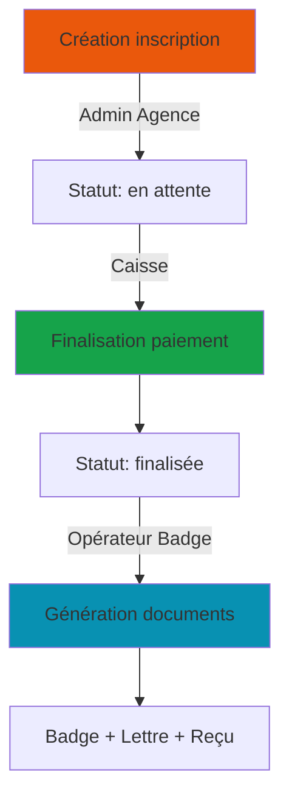

# 🔧 SPÉCIFICATIONS TECHNIQUES - PROFILS UTILISATEURS

## 📋 Table des matières

1. [Architecture globale](#architecture-globale)
2. [Détails techniques par profil](#détails-techniques-par-profil)
3. [Flux de données](#flux-de-données)
4. [API et endpoints](#api-et-endpoints)
5. [Schéma de données](#schéma-de-données)

---

## 🏗️ Architecture globale

### Structure de l'application

```
App.tsx (Router profils)
    │
    ├── Admin Agence ──────► Dashboard.tsx + Sidebar.tsx
    │                         └── Pages complètes (CRUD complet)
    │
    ├── Admin FANAF ───────► AdminFanafDashboard.tsx + AdminFanafSidebar.tsx
    │                         └── Pages lecture seule + Module Encaissement
    │
    ├── Caisse ────────────► AgentFanafDashboard.tsx + AgentFanafSidebar.tsx
    │                         └── CaisseInscriptionsPage.tsx (Finalisation)
    │
    ├── Opérateur Caisse ──► OperateurCaisseMain.tsx + Sidebar
    │                         └── Pages paiements uniquement
    │
    └── Opérateur Badge ───► OperateurBadgeMain.tsx + Sidebar
                              └── DocumentsParticipantsPage.tsx
```

### Points d'entrée

```typescript
// App.tsx
type UserProfile = 'agence' | 'fanaf' | 'agent' | 'operateur' | 'badge';

const renderProfile = (profile: UserProfile) => {
  switch (profile) {
    case 'agence':
      return <Dashboard />;
    case 'fanaf':
      return <AdminFanafDashboard />;
    case 'agent':
      return <AgentFanafDashboard />;
    case 'operateur':
      return <OperateurCaisseMain />;
    case 'badge':
      return <OperateurBadgeMain />;
  }
};
```

---

## 🔐 Détails techniques par profil

### 1. Admin Agence de Communication

#### Permissions
```typescript
const permissions = {
  inscriptions: { read: true, write: true, delete: true },
  organisations: { read: true, write: true, delete: true },
  networking: { read: true, write: true, delete: true },
  comite: { read: true, write: true, delete: true },
  sponsors: { read: true, write: true, delete: true },
  analytics: { read: true, write: false, delete: false },
  finance: { read: true, write: true, delete: false },
};
```

#### Routes de navigation
```typescript
const routes = [
  { path: '/accueil', component: 'DashboardHome', icon: 'Home' },
  { path: '/inscriptions', component: 'InscriptionsPage', icon: 'Users' },
  { path: '/organisations', component: 'OrganisationsPage', icon: 'Building2' },
  { path: '/networking', component: 'NetworkingPage', icon: 'Network' },
  { path: '/comite', component: 'ComiteOrganisationPage', icon: 'Shield' },
  { path: '/sponsors', component: 'ReservationsPage', icon: 'Star' },
  { path: '/analytics', component: 'DashboardAnalytics', icon: 'BarChart3' },
  { path: '/finance', component: 'FinancePage', icon: 'Wallet' },
  { path: '/calendar', component: 'CalendarView', icon: 'Calendar' },
  { path: '/historique', component: 'HistoriqueDemandesPage', icon: 'Clock' },
  { path: '/check-in', component: 'CheckInScanner', icon: 'Scan' },
];
```

#### Fonctionnalités principales

**InscriptionsPage.tsx**
```typescript
interface InscriptionActions {
  create: (data: ParticipantData) => Promise<Participant>;
  update: (id: string, data: Partial<ParticipantData>) => Promise<void>;
  delete: (id: string) => Promise<void>;
  export: () => Blob; // Export CSV/Excel
  filter: (criteria: FilterCriteria) => Participant[];
  search: (query: string) => Participant[];
}
```

**OrganisationsPage.tsx**
```typescript
interface OrganisationActions {
  create: (data: OrganisationData) => Promise<Organisation>;
  update: (id: string, data: Partial<OrganisationData>) => Promise<void>;
  delete: (id: string) => Promise<void>;
  addParticipant: (orgId: string, participantId: string) => Promise<void>;
  removeParticipant: (orgId: string, participantId: string) => Promise<void>;
}
```

---

### 2. Administrateur FANAF

#### Permissions
```typescript
const permissions = {
  inscriptions: { read: true, write: false, delete: false },
  organisations: { read: true, write: false, delete: false },
  networking: { read: true, write: false, delete: false },
  comite: { read: true, write: false, delete: false },
  encaissement: { read: true, write: true, delete: false }, // FULL ACCESS
  analytics: { read: true, write: false, delete: false },
};
```

#### Module Encaissement - Routes
```typescript
const encaissementRoutes = [
  { 
    path: '/paiements/dashboard', 
    component: 'PaiementsDashboardPage',
    description: 'Vue d\'ensemble des encaissements'
  },
  { 
    path: '/paiements/liste', 
    component: 'ListePaiementsPage',
    description: 'Liste complète de tous les paiements'
  },
  { 
    path: '/paiements/inscriptions', 
    component: 'ListeInscriptionsPage',
    description: 'Inscriptions avec détails paiement'
  },
  { 
    path: '/paiements/en-attente', 
    component: 'PaiementsEnAttentePage',
    description: 'Paiements non finalisés'
  },
  { 
    path: '/paiements/groupes', 
    component: 'PaiementsGroupesPage',
    description: 'Analyse par groupes/organisations'
  },
  { 
    path: '/paiements/tous', 
    component: 'TousPaiementsPage',
    description: 'Vue consolidée'
  },
  { 
    path: '/paiements/finalises', 
    component: 'ParticipantsFinalisesPage',
    description: 'Participants avec paiement validé'
  },
];
```

#### Structure des données Encaissement
```typescript
interface Paiement {
  id: string;
  participantId: string;
  montant: number;
  modePaiement: 'espèce' | 'carte bancaire' | 'orange money' | 'wave' | 'virement' | 'chèque';
  statut: 'en attente' | 'finalisé' | 'annulé';
  datePaiement: string; // ISO 8601
  dateCreation: string;
  operateur: string; // ID de l'utilisateur ayant traité
  reference: string; // REF-YYYY-XXXXX
  montantPercu?: number; // Pour mode espèce
  rendu?: number; // Pour mode espèce
  numeroCheque?: string; // Pour mode chèque
  banque?: string; // Pour mode chèque/virement
  notes?: string;
}
```

---

### 3. Caisse (Agent FANAF)

#### Permissions
```typescript
const permissions = {
  inscriptions: { 
    read: true, 
    write: true, // Uniquement finalisation
    delete: false 
  },
  documents: { 
    read: true, 
    write: true, // Génération
    delete: false 
  },
};
```

#### Workflow de finalisation

```typescript
interface FinalisationWorkflow {
  // Étape 1 : Sélection participant
  selectParticipant: (id: string) => void;
  
  // Étape 2 : Validation paiement
  validatePayment: {
    modePaiement: ModePaiement;
    montantPercu?: number;
    numeroCheque?: string;
    banque?: string;
  };
  
  // Étape 3 : Calcul automatique
  calculateChange: (montantPercu: number, montantDu: number) => number;
  
  // Étape 4 : Enregistrement
  finalizePayment: () => Promise<void>;
  
  // Étape 5 : Génération documents
  generateDocuments: {
    badge: () => Promise<Blob>;
    lettre: () => Promise<Blob>;
    recu?: () => Promise<Blob>; // Si applicable
  };
}
```

#### Règles de tarification
```typescript
const getTarif = (statut: ParticipantStatut): number => {
  const tarifs = {
    'membre': 350000, // 350 000 FCFA
    'non-membre': 400000, // 400 000 FCFA
    'vip': 0, // Exonéré
    'speaker': 0, // Exonéré
  };
  return tarifs[statut];
};

const shouldGenerateReceipt = (statut: ParticipantStatut): boolean => {
  return statut === 'membre' || statut === 'non-membre';
};
```

#### CaisseInscriptionsPage - État local
```typescript
const [selectedParticipant, setSelectedParticipant] = useState<Participant | null>(null);
const [isFinalizingPayment, setIsFinalizingPayment] = useState(false);
const [modePaiement, setModePaiement] = useState<ModePaiement>('espèce');
const [montantPercu, setMontantPercu] = useState<string>('');
const [numeroCheque, setNumeroCheque] = useState<string>('');
const [banque, setBanque] = useState<string>('');

// Gestion du rendu monnaie
const montantDu = getTarif(selectedParticipant?.statut);
const rendu = modePaiement === 'espèce' 
  ? parseFloat(montantPercu) - montantDu 
  : 0;
```

---

### 4. Opérateur Caisse (Paiements)

#### Permissions
```typescript
const permissions = {
  paiements: { read: true, write: false, delete: false },
  dashboard: { read: true, write: false, delete: false },
  export: { read: true, write: false, delete: false },
};
```

#### OperateurCaisseDashboard - Statistiques

```typescript
interface DashboardStats {
  // Statistiques principales
  totalPaiements: {
    count: number;
    montantTotal: number;
  };
  
  paiementsEnAttente: {
    count: number;
    montantTotal: number;
  };
  
  paiementsFinalises: {
    count: number;
    montantTotal: number;
  };
  
  // Répartition par mode
  repartitionModes: {
    mode: ModePaiement;
    count: number;
    montant: number;
    pourcentage: number;
  }[];
  
  // Évolution temporelle
  evolution: {
    date: string;
    paiements: number;
    montant: number;
  }[];
  
  // Taux de finalisation
  tauxFinalisation: number; // Pourcentage
}
```

#### Graphiques Recharts
```typescript
// Graphique en camembert - Répartition modes
<PieChart width={400} height={300}>
  <Pie
    data={repartitionModes}
    dataKey="montant"
    nameKey="mode"
    cx="50%"
    cy="50%"
    outerRadius={80}
    label
  />
  <Tooltip />
  <Legend />
</PieChart>

// Graphique en ligne - Évolution
<LineChart width={600} height={300} data={evolution}>
  <CartesianGrid strokeDasharray="3 3" />
  <XAxis dataKey="date" />
  <YAxis />
  <Tooltip />
  <Legend />
  <Line type="monotone" dataKey="montant" stroke="#8b5cf6" />
</LineChart>
```

---

### 5. Opérateur Badge

#### Permissions
```typescript
const permissions = {
  documents: { read: true, write: true, delete: false },
  participants: { read: true, write: false, delete: false }, // Lecture uniquement
  export: { read: true, write: false, delete: false },
};
```

#### DocumentsParticipantsPage - État et filtres

```typescript
const [searchTerm, setSearchTerm] = useState('');
const [filtreModePaiement, setFiltreModePaiement] = useState<string>('all');
const [filtreOrganisation, setFiltreOrganisation] = useState<string>('all');
const [filtrePeriode, setFiltrePeriode] = useState<string>('all');
const [dateDebut, setDateDebut] = useState<string>('');
const [dateFin, setDateFin] = useState<string>('');

// Filtre de période personnalisé
const filterByDateRange = (participant: Participant): boolean => {
  if (filtrePeriode !== 'custom') return true;
  
  const paymentInfo = getPaymentInfo(participant);
  const datePaiement = paymentInfo.datePaiement 
    ? new Date(paymentInfo.datePaiement) 
    : null;
  
  if (!datePaiement) return false;
  
  const paiementTime = datePaiement.getTime();
  const debutTime = dateDebut ? new Date(dateDebut).getTime() : -Infinity;
  const finTime = dateFin ? new Date(dateFin + 'T23:59:59').getTime() : Infinity;
  
  return paiementTime >= debutTime && paiementTime <= finTime;
};
```

#### Génération de documents

```typescript
// Badge individuel
const generateBadge = async (participant: Participant): Promise<void> => {
  const badgeElement = document.getElementById(`badge-${participant.id}`);
  const canvas = await html2canvas(badgeElement);
  const blob = await canvas.toBlob();
  downloadBlob(blob, `badge-${participant.reference}.png`);
};

// Lettre d'invitation
const generateLettre = async (participant: Participant): Promise<void> => {
  // Utilise InvitationLetterGenerator
  const lettreElement = document.getElementById(`lettre-${participant.id}`);
  // ... conversion et téléchargement
};

// Reçu de paiement (si applicable)
const generateRecu = async (participant: Participant): Promise<void> => {
  if (!shouldGenerateReceipt(participant.statut)) {
    toast.error('Reçu non disponible pour ce statut');
    return;
  }
  // Utilise ReceiptGenerator
  // ... conversion et téléchargement
};
```

#### Téléchargement groupé (ZIP)

```typescript
const downloadAllBadges = async (): Promise<void> => {
  setIsDownloadingBadges(true);
  const zip = new JSZip();
  
  for (const participant of participantsFinalisés) {
    const badgeElement = document.getElementById(`badge-${participant.id}`);
    const canvas = await html2canvas(badgeElement);
    const blob = await canvas.toBlob();
    zip.file(`badge-${participant.reference}.png`, blob);
  }
  
  const zipBlob = await zip.generateAsync({ type: 'blob' });
  downloadBlob(zipBlob, `badges-fanaf-${new Date().toISOString()}.zip`);
  
  setIsDownloadingBadges(false);
  toast.success(`${participantsFinalisés.length} badges téléchargés`);
};
```

---

## 🔄 Flux de données

### 1. Cycle de vie d'une inscription



### 2. Synchronisation localStorage

```typescript
// 1. Écriture (Caisse)
const finalizePaiement = (participant: Participant) => {
  // Mise à jour des IDs finalisés
  const finalisedIds = new Set(
    JSON.parse(localStorage.getItem('finalisedParticipantsIds') || '[]')
  );
  finalisedIds.add(participant.id);
  localStorage.setItem('finalisedParticipantsIds', JSON.stringify([...finalisedIds]));
  
  // Enregistrement détails paiement
  const payments = JSON.parse(localStorage.getItem('finalisedPayments') || '{}');
  payments[participant.id] = {
    datePaiement: new Date().toISOString(),
    modePaiement,
    montantPercu,
    rendu,
  };
  localStorage.setItem('finalisedPayments', JSON.stringify(payments));
  
  // Déclenchement événement
  window.dispatchEvent(new Event('paymentFinalized'));
};

// 2. Lecture (Opérateur Badge, Opérateur Caisse)
useEffect(() => {
  const handleStorageChange = () => {
    const stored = localStorage.getItem('finalisedParticipantsIds');
    setFinalisedParticipantsIds(stored ? new Set(JSON.parse(stored)) : new Set());
  };
  
  const handlePaymentFinalized = () => {
    handleStorageChange();
    toast.success('Nouveau paiement finalisé !');
  };
  
  window.addEventListener('storage', handleStorageChange);
  window.addEventListener('paymentFinalized', handlePaymentFinalized);
  
  return () => {
    window.removeEventListener('storage', handleStorageChange);
    window.removeEventListener('paymentFinalized', handlePaymentFinalized);
  };
}, []);
```

---

## 🌐 API et endpoints

### Endpoints à implémenter

```typescript
// Participants
GET    /api/participants              // Liste tous les participants
GET    /api/participants/:id          // Détails d'un participant
POST   /api/participants              // Créer un participant (Admin Agence)
PUT    /api/participants/:id          // Modifier un participant (Admin Agence)
DELETE /api/participants/:id          // Supprimer un participant (Admin Agence)

// Paiements
GET    /api/paiements                 // Liste tous les paiements
GET    /api/paiements/:id             // Détails d'un paiement
POST   /api/paiements                 // Créer un paiement
PUT    /api/paiements/:id/finaliser   // Finaliser un paiement (Caisse)
GET    /api/paiements/stats           // Statistiques (Admin FANAF, Opérateur Caisse)

// Documents
GET    /api/documents/badge/:id       // Générer badge (Opérateur Badge)
GET    /api/documents/lettre/:id      // Générer lettre (Opérateur Badge)
GET    /api/documents/recu/:id        // Générer reçu (Opérateur Badge)
POST   /api/documents/bulk-badges     // Téléchargement groupé badges

// Organisations
GET    /api/organisations             // Liste organisations
GET    /api/organisations/:id         // Détails organisation
POST   /api/organisations             // Créer organisation (Admin Agence)
PUT    /api/organisations/:id         // Modifier organisation (Admin Agence)

// Analytics
GET    /api/analytics/dashboard       // Stats tableau de bord
GET    /api/analytics/evolution       // Évolution inscriptions
GET    /api/analytics/financier       // Analyse financière
```

### Authentification et autorisation

```typescript
// Middleware d'authentification
interface AuthenticatedRequest extends Request {
  user: {
    id: string;
    profile: UserProfile;
    permissions: Permissions;
  };
}

const requireAuth = (profile: UserProfile | UserProfile[]) => {
  return (req: AuthenticatedRequest, res: Response, next: NextFunction) => {
    const allowedProfiles = Array.isArray(profile) ? profile : [profile];
    
    if (!allowedProfiles.includes(req.user.profile)) {
      return res.status(403).json({ error: 'Accès refusé' });
    }
    
    next();
  };
};

// Exemple d'utilisation
app.post('/api/participants', 
  requireAuth('agence'), 
  createParticipant
);

app.post('/api/paiements/:id/finaliser', 
  requireAuth(['agent', 'agence']), 
  finalizePaiement
);
```

---

## 📊 Schéma de données

### Participant
```typescript
interface Participant {
  id: string;                    // UUID
  reference: string;             // REF-YYYY-XXXXX
  nom: string;
  prenom: string;
  email: string;
  telephone: string;
  organisationId: string;        // FK vers Organisation
  statut: 'membre' | 'non-membre' | 'vip' | 'speaker';
  statutInscription: 'en attente' | 'finalisée';
  fonction?: string;
  dateInscription: string;       // ISO 8601
  datePaiement?: string;         // ISO 8601
  modePaiement?: ModePaiement;
  montantPaye?: number;
  notes?: string;
  qrCode?: string;               // Données QR code
  createdAt: string;
  updatedAt: string;
}
```

### Organisation
```typescript
interface Organisation {
  id: string;                    // UUID
  nom: string;
  type: 'compagnie' | 'courtier' | 'réassureur' | 'partenaire';
  pays: string;
  ville?: string;
  email?: string;
  telephone?: string;
  adresse?: string;
  estMembre: boolean;            // Membre FANAF ou non
  nombreParticipants: number;    // Calculé
  logo?: string;                 // URL du logo
  createdAt: string;
  updatedAt: string;
}
```

### Paiement
```typescript
interface Paiement {
  id: string;                    // UUID
  reference: string;             // PAY-YYYY-XXXXX
  participantId: string;         // FK vers Participant
  organisationId: string;        // FK vers Organisation
  montant: number;               // Montant dû
  montantPercu?: number;         // Pour espèce
  rendu?: number;                // Pour espèce
  modePaiement: ModePaiement;
  statut: 'en attente' | 'finalisé' | 'annulé';
  datePaiement?: string;         // ISO 8601
  dateCreation: string;          // ISO 8601
  operateurId?: string;          // FK vers User
  numeroCheque?: string;         // Pour chèque
  banque?: string;               // Pour chèque/virement
  notes?: string;
  createdAt: string;
  updatedAt: string;
}
```

### User (Authentification)
```typescript
interface User {
  id: string;                    // UUID
  email: string;
  nom: string;
  prenom: string;
  profile: UserProfile;
  isActive: boolean;
  lastLogin?: string;            // ISO 8601
  createdAt: string;
  updatedAt: string;
}
```

### Relations de base de données

```sql
-- Table participants
CREATE TABLE participants (
  id UUID PRIMARY KEY DEFAULT gen_random_uuid(),
  reference VARCHAR(50) UNIQUE NOT NULL,
  nom VARCHAR(100) NOT NULL,
  prenom VARCHAR(100) NOT NULL,
  email VARCHAR(255) NOT NULL,
  telephone VARCHAR(50),
  organisation_id UUID REFERENCES organisations(id),
  statut VARCHAR(20) NOT NULL,
  statut_inscription VARCHAR(20) DEFAULT 'en attente',
  fonction VARCHAR(100),
  date_inscription TIMESTAMP DEFAULT NOW(),
  date_paiement TIMESTAMP,
  mode_paiement VARCHAR(50),
  montant_paye DECIMAL(10,2),
  notes TEXT,
  qr_code TEXT,
  created_at TIMESTAMP DEFAULT NOW(),
  updated_at TIMESTAMP DEFAULT NOW()
);

-- Table organisations
CREATE TABLE organisations (
  id UUID PRIMARY KEY DEFAULT gen_random_uuid(),
  nom VARCHAR(255) NOT NULL,
  type VARCHAR(50) NOT NULL,
  pays VARCHAR(100) NOT NULL,
  ville VARCHAR(100),
  email VARCHAR(255),
  telephone VARCHAR(50),
  adresse TEXT,
  est_membre BOOLEAN DEFAULT FALSE,
  logo TEXT,
  created_at TIMESTAMP DEFAULT NOW(),
  updated_at TIMESTAMP DEFAULT NOW()
);

-- Table paiements
CREATE TABLE paiements (
  id UUID PRIMARY KEY DEFAULT gen_random_uuid(),
  reference VARCHAR(50) UNIQUE NOT NULL,
  participant_id UUID REFERENCES participants(id) ON DELETE CASCADE,
  organisation_id UUID REFERENCES organisations(id),
  montant DECIMAL(10,2) NOT NULL,
  montant_percu DECIMAL(10,2),
  rendu DECIMAL(10,2),
  mode_paiement VARCHAR(50) NOT NULL,
  statut VARCHAR(20) DEFAULT 'en attente',
  date_paiement TIMESTAMP,
  date_creation TIMESTAMP DEFAULT NOW(),
  operateur_id UUID REFERENCES users(id),
  numero_cheque VARCHAR(100),
  banque VARCHAR(255),
  notes TEXT,
  created_at TIMESTAMP DEFAULT NOW(),
  updated_at TIMESTAMP DEFAULT NOW()
);

-- Table users
CREATE TABLE users (
  id UUID PRIMARY KEY DEFAULT gen_random_uuid(),
  email VARCHAR(255) UNIQUE NOT NULL,
  nom VARCHAR(100) NOT NULL,
  prenom VARCHAR(100) NOT NULL,
  profile VARCHAR(50) NOT NULL,
  is_active BOOLEAN DEFAULT TRUE,
  last_login TIMESTAMP,
  created_at TIMESTAMP DEFAULT NOW(),
  updated_at TIMESTAMP DEFAULT NOW()
);

-- Index pour performances
CREATE INDEX idx_participants_organisation ON participants(organisation_id);
CREATE INDEX idx_participants_statut ON participants(statut_inscription);
CREATE INDEX idx_paiements_participant ON paiements(participant_id);
CREATE INDEX idx_paiements_statut ON paiements(statut);
CREATE INDEX idx_paiements_date ON paiements(date_paiement);
```

---

## 🔧 Configuration et variables d'environnement

```env
# Supabase
SUPABASE_URL=https://xxxxx.supabase.co
SUPABASE_ANON_KEY=eyJhbGciOiJIUzI1NiIsInR5cCI6IkpXVCJ9...
SUPABASE_SERVICE_ROLE_KEY=eyJhbGciOiJIUzI1NiIsInR5cCI6IkpXVCJ9...

# Application
REACT_APP_API_URL=https://api.fanaf2026.com
REACT_APP_ENV=production

# Documents
MAX_BADGE_SIZE=5242880  # 5 MB
ZIP_COMPRESSION_LEVEL=6

# Cache
CACHE_TTL=3600  # 1 heure
```

---

## 📈 Métriques et monitoring

### Événements à logger

```typescript
// Connexions
logEvent('user.login', { profile, userId, timestamp });
logEvent('user.logout', { profile, userId, duration, timestamp });

// Inscriptions
logEvent('inscription.created', { participantId, organisationId, statut });
logEvent('inscription.updated', { participantId, changes });
logEvent('inscription.deleted', { participantId });

// Paiements
logEvent('paiement.created', { paiementId, participantId, montant });
logEvent('paiement.finalized', { paiementId, modePaiement, operateur });
logEvent('paiement.cancelled', { paiementId, reason });

// Documents
logEvent('document.generated', { type, participantId, format });
logEvent('documents.bulk_download', { count, type });

// Erreurs
logError('error.occurred', { component, error, stack, user });
```

---

**Date de création** : 27 octobre 2025  
**Version** : 1.0  
**Statut** : Documentation technique complète
